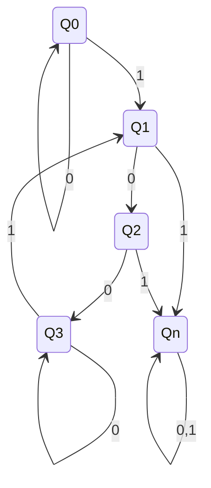

# automata-tester

简单的 DFA、NFA 测试工具：

* 创建 accepter automata 对输入字符串进行检验。
* 解析 mermaid 的 stateDiagram 语法，获取 alphabet、state state、final states、transition、all_states，生成相应的 DFA/NFA(自动判断是否为 NFA)。
* NFA 目前暂且 TODO.
* 根据 alphabet 自动生成随机数据、传入自定义检验函数 test_func 与 automata 进行测试，保证 automata 符合语义预期。

这是为了检验 Formal Language and Automata 这门学校课程中作业解答正确性而开发的小工具(?).

如果你还不了解 mermaid，可以[点击这里](https://mermaid.js.org/syntax/stateDiagram.html)了解一下。Mermaid 用来画 State Diagram 等常用的图非常方便，我的作业中的自动机、以及 README 中那张图都是使用 Mermaid 绘制的。

使用方法很简单，详细见 `main.py`. 这里说明一下 mermaid 的标记方法：

正常标记状态，使用 `[*] --> Q0` 标记 `Q0` 为起始状态，使用 `Q1 --> [*]` 标记 `Q1` 为结束状态。特别地，你可以将这行在 mermaid 中注释掉以避免输出过于复杂的图，但依然可以正常检索到起始、终止状态。

下面是一个例子。



使用方法：修改 `main.py` 的内容，添加你自己的测试函数，类似：

```python
def test_hw2():
    # all substring of length 3 at most contains one '1'
    mermaid = """stateDiagram-v2
#[*] --> Q0
Q0 --> Q0: 0
Q0 --> Q1: 1
Q1 --> Q2: 0
Q2 --> Q3: 0
Q3 --> Q3: 0
Q3 --> Q1: 1
Q1 --> Qn: 1
Q2 --> Qn: 1
Qn --> Qn: 0,1
#Q0 --> [*]
#Q1 --> [*]
#Q2 --> [*]
#Q3 --> [*]"""
    res, d = parse_mermaid(mermaid)
    if res != "DFA":
        raise ValueError("Not a DFA")
    def test_func(input: str) -> bool:
        for i in range(len(input) - 2):
            if input[i:i+3].count('1') > 1:
                return False
        return True
    # at least 3 characters
    random_test(d.run, d.alphabet, 1000, test_func, input_gen=lambda a : random_str_len(a, 3, 30))

```

然后添加到程序相应位置、运行 `python main.py` 即可。  
理论上没有特殊依赖，有 Python 基础环境即可运行。本地环境 Python3.11，若无法运行请升级 Python 版本。  
确定不是自身环境问题可以提 Issue.

